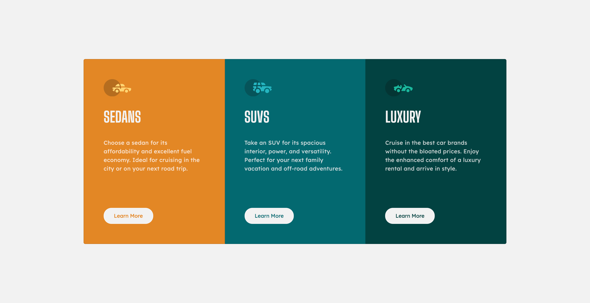
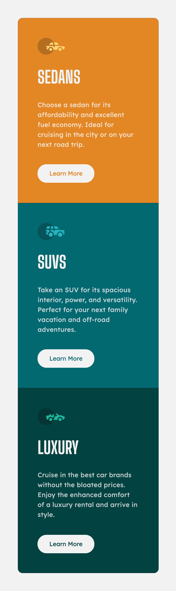

# Frontend Mentor - 3-column preview card component solution

This is a solution to the [3-column preview card component challenge on Frontend Mentor](https://www.frontendmentor.io/challenges/3column-preview-card-component-pH92eAR2-). 

## Table of contents

- [Overview](#overview)
  - [The challenge](#the-challenge)
  - [Screenshot](#screenshot)
  - [Links](#links)
- [My process](#my-process)
  - [Built with](#built-with)
  - [What I learned](#what-i-learned)
  - [Continued development](#continued-development)
  - [Useful resources](#useful-resources)
- [Author](#author)


## Overview

### The challenge

Users should be able to:

- View the optimal layout depending on their device's screen size
- See hover states for interactive elements

### Screenshot





### Links

- Solution URL: [https://github.com/SpiritedSea091/frontend-project-2](https://your-solution-url.com)
- Live Site URL: [https://spiritedsea091.github.io/frontend-project-2/](https://spiritedsea091.github.io/frontend-project-2/)

## My process

### Built with

- Semantic HTML5 markup
- CSS custom properties
- Bootstrap 

### What I learned

This was a great opportunity to work with Bootstrap Cards which were then customised with CSS.
```html
<div class="container">
      <div class="card-group">
        <div class="card sedan">
```
The CSS complexity in this challenge was with applying card-specific border radii in the mobile version.
```css
@media only screen and (max-width: 600px){
  .card-text{
    margin-bottom: 15%;
  }
  .sedan{
    border-radius: 10px 10px 0 0;
  }
  .suv{
    border-radius: 0;
  }
  .luxury{
    border-radius: 0 0 10px 10px;
  }
}
```

### Continued development

I would like to improve the speed with which I develop these components and also come up with a workflow for ensuring I achieve speed and reduce time debugging.

### Useful resources

- [Bootstrap Cards](https://getbootstrap.com/docs/5.0/components/card/) - Resource to deploy cards for rapid development.

## Author


- Frontend Mentor - [@SpiritedSea091](https://www.frontendmentor.io/profile/SpiritedSea091)
- Twitter - [@spiritedsea091](https://www.twitter.com/spiritedsea091)

